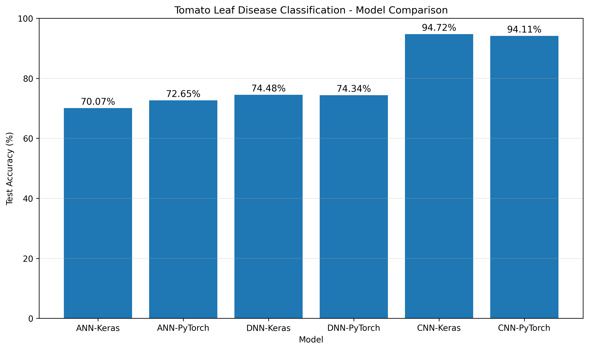

# Tomato Leaf Disease Classification

토마토 잎 이미지를 대상으로 **ANN, DNN, CNN의 이미지 분류 성능을
비교**하고,\
Keras와 PyTorch 두 프레임워크에서 동일한 목적의 모델을 구현하여 성능
차이를 비교한 프로젝트입니다.

------------------------------------------------------------------------

## 1. 프로젝트 개요

토마토 잎 질병 이미지를 7개 클래스로 분류하고, 모델 구조의 차이가 이미지
분류 성능에 어떤 영향을 주는지 비교했습니다.

비교 대상은 다음과 같습니다.

-   Single-Layer ANN
-   DNN
-   CNN
-   Keras
-   PyTorch

최종적으로 **6개 모델(ANN/DNN/CNN × Keras/PyTorch)**을 동일한 Test
Dataset으로 평가했습니다.

### 핵심 결과

CNN이 ANN과 DNN보다 높은 Test Accuracy를 기록했습니다.

-   ANN: 약 70\~73%
-   DNN: 약 74%
-   CNN: 약 94\~95%

이를 통해 이미지의 공간적 특징을 활용하는 CNN이 단순 완전연결 신경망보다
토마토 잎 이미지 분류에 효과적임을 확인했습니다.


### 📊 Final Model Performance



| Architecture | Keras | PyTorch |
|---|---:|---:|
| ANN | 70.07% | 72.65% |
| DNN | 74.48% | 74.34% |
| CNN | **94.72%** | **94.11%** |

### 🔍 CNN Feature Map


Keras CNN의 Conv1, Conv2, Conv3에서 추출된 대표 Feature Map을 시각화하여
CNN 내부의 특징 추출 과정을 확인했습니다.


------------------------------------------------------------------------

## 2. Dataset

### Dataset

PlantVillage 기반 토마토 잎 이미지 데이터셋을 사용했습니다.

최종 실험에서는 토마토 관련 7개 클래스를 선정했습니다.

``` text
Tomato___Bacterial_spot
Tomato___Late_blight
Tomato___Septoria_leaf_spot
Tomato___Spider_mites Two-spotted_spider_mite
Tomato___Target_Spot
Tomato___Tomato_Yellow_Leaf_Curl_Virus
Tomato___healthy
```

각 클래스는 1,400장씩 사용하여 클래스 간 데이터 수를 균형 있게
구성했습니다.

### Dataset Split

``` text
Train      : 6,853
Validation : 1,470
Test       : 1,477
Total      : 9,800
```

데이터 분할 과정에서는 SHA-256 기반 중복 검사를 수행하여 동일 이미지가
Train/Validation/Test에 중복 포함되지 않도록 정리했습니다.

------------------------------------------------------------------------

## 3. Experimental Conditions

모델 간 비교가 가능하도록 주요 학습 조건을 통일했습니다.

  항목                설정
  ------------------- --------------------------------
  Input Size          64×64 (ANN/DNN), 128×128 (CNN)
  Classes             7
  Epochs              30
  Batch Size          32
  Optimizer           Adam
  Learning Rate       0.001
  Data Augmentation   사용하지 않음
  Random Seed         42
  Evaluation          Test Dataset

CNN은 공간적 특징을 충분히 유지하기 위해 128×128 입력을 사용했고,
ANN/DNN은 완전연결 구조의 입력 크기를 64×64로 설정했습니다.

------------------------------------------------------------------------

# 4. Model Architecture

## 4.1 Single-Layer ANN

프로젝트에서는 ANN과 DNN을 구분하기 위해 **ANN을 단일 은닉층이 없는 단일
선형 분류 구조**로 정의했습니다.

``` text
Input 64×64×3
      ↓
Rescaling
      ↓
Flatten
      ↓
Dense / Linear (12288 → 7)
      ↓
Softmax
```

총 파라미터:

``` text
86,023
```

이미지의 픽셀을 Flatten하여 바로 7개 클래스로 분류하기 때문에 이미지의
공간적 구조를 직접적으로 활용하지 않습니다.

------------------------------------------------------------------------

## 4.2 DNN

DNN은 2개 이상의 은닉층을 갖는 완전연결 신경망으로 구성했습니다.

``` text
Input 64×64×3
      ↓
Flatten
      ↓
Dense 128 + ReLU
      ↓
Dense 64 + ReLU
      ↓
Dense 32 + ReLU
      ↓
Dropout 0.5
      ↓
Output 7
```

### Keras DNN

Keras DNN에서는 은닉층에 **He Normal 초기화**와 **Dropout 0.5**를
적용했습니다.

``` text
He Normal Initialization
Dropout = 0.5
```

최종 Keras DNN Test Accuracy:

``` text
74.48%
```

### PyTorch DNN

PyTorch DNN에서는 동일한 구조를 사용하고 PyTorch의 기본 Linear 초기화를
사용했습니다.

최종 PyTorch DNN Test Accuracy:

``` text
74.34%
```

------------------------------------------------------------------------

## 4.3 CNN

CNN은 이미지의 공간적 특징을 학습할 수 있도록 합성곱 층과 풀링 층을
사용했습니다.

``` text
Input 128×128×3
      ↓
Conv2D 32 + ReLU
      ↓
MaxPooling
      ↓
Conv2D 64 + ReLU
      ↓
MaxPooling
      ↓
Conv2D 128 + ReLU
      ↓
MaxPooling
      ↓
Flatten
      ↓
Dense 128 + ReLU
      ↓
Dropout 0.5
      ↓
Output 7
```

Keras와 PyTorch에서 동일한 개념의 CNN 구조를 구현했습니다.

------------------------------------------------------------------------

# 5. Final Model Performance

## Test Accuracy

  Architecture          Keras      PyTorch
  -------------- ------------ ------------
  ANN                  70.07%       72.65%
  DNN                  74.48%       74.34%
  CNN              **94.72%**   **94.11%**

### Performance Comparison

``` text
ANN-Keras       70.07%
ANN-PyTorch     72.65%

DNN-Keras       74.48%
DNN-PyTorch     74.34%

CNN-Keras       94.72%
CNN-PyTorch     94.11%
```

### 결과 해석

ANN에서 DNN으로 은닉층을 추가했을 때 성능이 소폭 향상되었습니다.

그러나 CNN에서는 약 94% 이상의 Test Accuracy를 기록하며 완전연결 기반
ANN/DNN보다 큰 성능 향상을 확인했습니다.

이는 CNN이 이미지의 **공간적 구조와 지역적인 특징을 학습**할 수 있기
때문으로 해석할 수 있습니다.

또한 Keras와 PyTorch의 CNN 결과가 각각 94.72%, 94.11%로 유사하게 나타나
프레임워크가 달라도 유사한 CNN 구조에서 높은 분류 성능을 확인할 수
있었습니다.

------------------------------------------------------------------------

# 6. Detailed Evaluation

최종 모델은 Accuracy뿐만 아니라 다음 지표를 함께 평가했습니다.

-   Accuracy
-   Precision
-   Recall
-   F1-score
-   Classification Report
-   Confusion Matrix

## Keras Single-Layer ANN

``` text
Accuracy : 70.07%
Precision: 71.45%
Recall   : 70.07%
F1-score : 69.26%

Best Epoch: 17
Best Validation Accuracy: 71.16%
```

## PyTorch Single-Layer ANN

``` text
Accuracy : 72.65%
Precision: 73.28%
Recall   : 72.65%
F1-score : 72.39%

Best Epoch: 24
Best Validation Accuracy: 72.59%
```

## Keras DNN

``` text
Test Accuracy: 74.48%
Best Epoch: 29
Best Validation Accuracy: 74.69%
```

## PyTorch DNN

``` text
Test Accuracy: 74.34%
Best Epoch: 29
Best Validation Accuracy: 77.01%
```

## Keras CNN

``` text
Accuracy : 94.72%
Precision: 94.74%
Recall   : 94.72%
F1-score : 94.70%

Best Epoch: 26
Best Validation Accuracy: 96.33%
```

## PyTorch CNN

``` text
Accuracy : 94.11%
Precision: 94.19%
Recall   : 94.11%
F1-score : 94.12%

Best Epoch: 29
Best Validation Accuracy: 95.65%
```

------------------------------------------------------------------------

# 7. Confusion Matrix Analysis

CNN의 Confusion Matrix를 통해 클래스별 오분류 패턴도 확인했습니다.

### Keras CNN

특히 **Target Spot → Spider Mites** 방향의 오분류가 상대적으로 많이
나타났습니다.

``` text
Target Spot → Spider Mites : 14
```

### PyTorch CNN

PyTorch CNN에서는 반대로

``` text
Spider Mites → Target Spot : 17
```

의 오분류가 확인되었습니다.

이를 통해 일부 토마토 잎 질병은 이미지의 시각적 특징이 유사하여 서로
혼동될 수 있음을 확인했습니다.

------------------------------------------------------------------------

# 8. CNN Feature Map Visualization

CNN 내부의 특징 추출 과정을 확인하기 위해 Keras CNN의 Feature Map을
시각화했습니다.

구성:

``` text
Original Image
      ↓
Conv1 Feature Maps
      ↓
Conv2 Feature Maps
      ↓
Conv3 Feature Maps
```

각 Convolution Layer에서 대표 Feature Map 8개씩을 선택하여 총 25개의
이미지를 하나의 시각화 자료로 구성했습니다.

### Feature Map 해석

-   **Conv1**
    -   잎의 윤곽
    -   경계
    -   색상 변화
    -   기본적인 패턴
-   **Conv2**
    -   잎의 형태
    -   질감
    -   중간 수준의 패턴
-   **Conv3**
    -   보다 추상적인 특징
    -   특정 영역에 선택적으로 반응하는 패턴

즉, CNN이 깊어질수록 단순한 시각적 특징에서 보다 복합적이고 추상적인
특징으로 표현이 변화하는 과정을 확인했습니다.

> Feature Map은 특정 병변을 정확하게 위치시키는 분석 결과가 아니라,
> CNN의 특징 추출 과정을 시각적으로 확인하기 위한 자료입니다.

------------------------------------------------------------------------

# 9. Learning Curves

각 모델의 학습 과정에서는 Train Accuracy / Validation Accuracy와 Train
Loss / Validation Loss를 기록했습니다.

특히 Single-Layer ANN에서는 Validation Accuracy의 변동 폭이 비교적 크게
나타났습니다.

반면 CNN은 높은 Validation Accuracy를 유지하면서 Test Accuracy에서도 약
94% 이상의 성능을 기록했습니다.

학습곡선을 통해 단순히 최종 Accuracy만 비교하는 것이 아니라 모델의 학습
과정과 일반화 성능을 함께 확인했습니다.

------------------------------------------------------------------------

# 10. Project Results

이번 실험에서 확인한 핵심 결과는 다음과 같습니다.

### 1. ANN

단일 선형 분류 구조에서도 토마토 잎 질병을 어느 정도 분류할 수 있었지만
Test Accuracy는 약 70\~73% 수준이었습니다.

### 2. DNN

은닉층을 추가하여 표현력을 높이면서 약 74%의 Test Accuracy를
기록했습니다.

### 3. CNN

합성곱과 풀링을 사용하여 이미지의 공간적 특징을 학습한 결과 약 94\~95%의
Test Accuracy를 기록했습니다.

### 최종 결론

> **이미지 분류 문제에서는 단순한 완전연결 구조보다 이미지의 공간적
> 특징을 학습할 수 있는 CNN이 더 높은 성능을 보였다.**

------------------------------------------------------------------------

# 11. Limitations

본 프로젝트에는 다음과 같은 한계가 있습니다.

- PlantVillage 기반 데이터는 실제 환경보다 비교적 통제된 촬영 조건을 포함할 수 있습니다.
- 실제 농업 환경에서는 조명, 배경, 촬영 거리, 잎의 상태 등에 따라 성능이 달라질 수 있습니다.
- 동일하거나 유사한 잎 이미지가 포함될 가능성은 데이터셋 자체의 특성상 완전히 배제하기 어렵습니다.
- 데이터 증강을 사용하지 않았기 때문에 실제 환경의 다양한 변화를 충분히 반영하지 못할 수 있습니다.
- 7개 토마토 클래스만 사용했기 때문에 모든 식물 질병으로 일반화할 수는 없습니다.

따라서 높은 Test Accuracy가 실제 현장에서 동일한 성능을 보장한다고 해석해서는 안 됩니다.

------------------------------------------------------------------------

# 12. Files

최종 GitHub 저장소는 다음과 같이 구성했습니다.

```text
tomato-leaf-disease-classification/
│
├── README.md
│
├── code/
│   ├── tomato_leaf_classification.ipynb
│   └── tomato_leaf_classification.py
│
├── results/
│   ├── keras_ann/
│   ├── pytorch_ann/
│   ├── keras_dnn/
│   ├── pytorch_dnn/
│   ├── keras_cnn/
│   ├── pytorch_cnn/
│   └── final_6_model_accuracy_comparison.xlsx
│
├── visualization/
│   ├── final_6_model_accuracy_comparison.png
│   └── tomato_cnn_feature_map_25.png
│
└── docs/
    └── tomato_leaf_disease.pptx
```

### Directory Description

| Directory | Description |
|---|---|
| `code/` | 데이터 검증부터 ANN·DNN·CNN 모델 구현 및 실험 과정을 포함한 코드 |
| `results/` | 6개 모델의 학습 결과, 평가 지표, Confusion Matrix 및 학습 기록 |
| `visualization/` | 6개 모델 성능 비교 및 CNN Feature Map 시각화 |
| `docs/` | 프로젝트 포트폴리오 |

------------------------------------------------------------------------

# 13. Technologies


-   Python
-   TensorFlow / Keras
-   PyTorch
-   NumPy
-   Pandas
-   Matplotlib
-   scikit-learn
-   Google Colab
-   CNN
-   DNN
-   ANN

------------------------------------------------------------------------

# 14. Summary

본 프로젝트에서는 동일한 토마토 잎 질병 분류 문제에 대해 ANN, DNN, CNN을
비교하고 Keras와 PyTorch로 각각 구현했습니다.

최종 Test Accuracy는 다음과 같습니다.

``` text
ANN
Keras    70.07%
PyTorch  72.65%

DNN
Keras    74.48%
PyTorch  74.34%

CNN
Keras    94.72%
PyTorch  94.11%
```

**CNN이 두 프레임워크 모두에서 가장 높은 성능을 기록했으며, 이미지의
공간적 특징을 활용하는 CNN 구조의 효과를 확인했습니다.**
